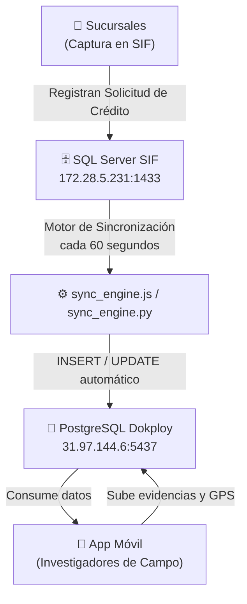
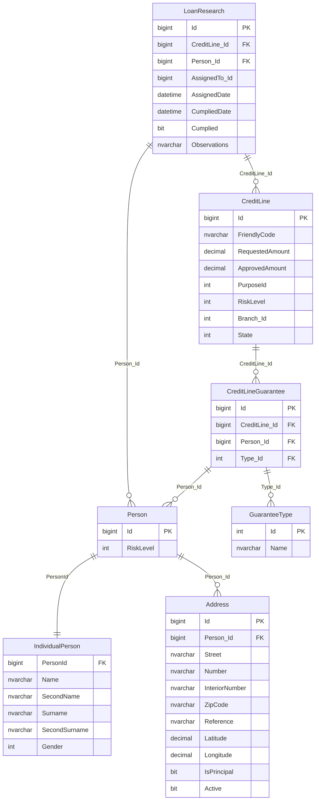

# 📊 Flujo de Datos: Sistema de Investigación de Campo
## De SQL Server (SIF) → PostgreSQL (App Móvil)

---

## 🏗️ Arquitectura General del Sistema



---

## 📍 Fase 1: Captura de Información en las Sucursales

Las sucursales operan directamente sobre el **SQL Server SIF** (`172.28.5.231`, base de datos `SIF`). Cuando un cliente solicita un crédito, el personal de la sucursal registra la información en las siguientes tablas:

| Tabla SIF (SQL Server) | Propósito |
|---|---|
| `PER.Person` | Registro base de la persona (cliente o aval) |
| `PER.IndividualPerson` | Datos personales detallados (nombres, apellidos, género) |
| `PER.Address` | Domicilio del cliente con coordenadas GPS |
| `LOA.CreditLine` | Solicitud de crédito (montos, folio, estado) |
| `LOA.CreditLineGuarantee` | Avales y garantías vinculadas al crédito |
| `LOA.GuaranteeType` | Catálogo de tipos de garantía |
| `LOA.LoanResearch` | **Tabla central**: orden de investigación de campo asignada |

---

## 🔄 Fase 2: Motor de Sincronización

El motor de sincronización ([sync_engine.js](file:///e:/bd-investigacion/sync_engine.js) / [sync_engine.py](file:///e:/bd-investigacion/sync_engine.py)) se ejecuta **cada 60 segundos** en modo continuo (`--watch`) y realiza 5 procesos en orden secuencial:

```
PROCESO A → PROCESO B → PROCESO C → PROCESO D → PROCESO E
 Persona      Dirección    Crédito      Avales    Investigación
```

---

## 📋 Proceso A — Sincronización de Personas (Clientes)

### 📥 Origen en SQL Server SIF

| Tabla | Columna SIF | Descripción |
|---|---|---|
| `PER.Person` | `Id` | ID único de la persona |
| `PER.Person` | `RiskLevel` | Nivel de riesgo crediticio |
| `PER.IndividualPerson` | `Name` | Primer nombre |
| `PER.IndividualPerson` | `SecondName` | Segundo nombre |
| `PER.IndividualPerson` | `Surname` | Primer apellido |
| `PER.IndividualPerson` | `SecondSurname` | Segundo apellido |
| `PER.IndividualPerson` | `Gender` | Género (numérico) |

> 🔗 **Join utilizado**: `PER.Person p LEFT JOIN PER.IndividualPerson ip ON p.Id = ip.PersonId`  
> 🔑 **Filtro**: `WHERE p.Id = @personId` (tomado de `LOA.LoanResearch.Person_Id`)

### 📤 Destino en PostgreSQL

| Columna PostgreSQL | Valor SIF | Notas |
|---|---|---|
| `id_sif` | `PER.Person.Id` | Clave primaria |
| `nombre_completo` | Concatenación de los 4 nombres | Se construye en el motor |
| `primer_nombre` | `IndividualPerson.Name` | |
| `segundo_nombre` | `IndividualPerson.SecondName` | |
| `primer_apellido` | `IndividualPerson.Surname` | |
| `segundo_apellido` | `IndividualPerson.SecondSurname` | |
| `genero` | `IndividualPerson.Gender` | |
| `es_aval` | `FALSE` | Se marca TRUE en Proceso D |
| `nivel_riesgo` | `PER.Person.RiskLevel` | |
| `updated_at` | `NOW()` | Timestamp de sincronización |

> ⚡ **Estrategia**: `INSERT ... ON CONFLICT (id_sif) DO UPDATE` — si ya existe, actualiza los datos.

---

## 📋 Proceso B — Sincronización de Direcciones

### 📥 Origen en SQL Server SIF

| Tabla | Columna SIF | Descripción |
|---|---|---|
| `PER.Address` | `Id` | ID único de la dirección |
| `PER.Address` | `Street` | Nombre de la calle |
| `PER.Address` | `Number` | Número exterior |
| `PER.Address` | `InteriorNumber` | Número interior |
| `PER.Address` | `ZipCode` | Código postal |
| `PER.Address` | `Reference` | Referencias del domicilio |
| `PER.Address` | `Latitude` | Coordenada GPS - latitud |
| `PER.Address` | `Longitude` | Coordenada GPS - longitud |
| `PER.Address` | `IsPrincipal` | Si es domicilio principal |
| `PER.Address` | `Active` | Si está activo |

> 🔑 **Filtro**: `WHERE Person_Id = @personId AND Active = 1`  
> 📌 **Selección**: Solo se toma **la dirección principal más reciente** (`ORDER BY IsPrincipal DESC, Id DESC`)

### 📤 Destino en PostgreSQL

| Columna PostgreSQL | Valor SIF | Notas |
|---|---|---|
| `id_sif` | `PER.Address.Id` | Clave primaria |
| `persona_id_sif` | `PER.Address.Person_Id` | FK → personas |
| `calle` | `Address.Street` | |
| `numero_exterior` | `Address.Number` | |
| `numero_interior` | `Address.InteriorNumber` | |
| `codigo_postal` | `Address.ZipCode` | |
| `referencias` | `Address.Reference` | |
| `latitud` | `Address.Latitude` | Coordenadas para el mapa |
| `longitud` | `Address.Longitude` | Coordenadas para el mapa |
| `es_principal` | `Address.IsPrincipal` | Booleano |
| `activa` | `Address.Active` | Booleano |
| `updated_at` | `NOW()` | |

---

## 📋 Proceso C — Sincronización de Solicitudes de Crédito

### 📥 Origen en SQL Server SIF

| Tabla | Columna SIF | Descripción |
|---|---|---|
| `LOA.CreditLine` | `Id` | ID de la línea de crédito |
| `LOA.CreditLine` | `FriendlyCode` | Folio legible del crédito |
| `LOA.CreditLine` | `RequestedAmount` | Monto solicitado por el cliente |
| `LOA.CreditLine` | `ApprovedAmount` | Monto que fue aprobado |
| `LOA.CreditLine` | `PurposeId` | Propósito del crédito (ID catálogo) |
| `LOA.CreditLine` | `RiskLevel` | Nivel de riesgo del crédito |
| `LOA.CreditLine` | `Branch_Id` | ID de la sucursal que capturó |
| `LOA.CreditLine` | `State` | Estado actual del crédito |

> 🔑 **Filtro**: `WHERE Id = @clId` (tomado de `LOA.LoanResearch.CreditLine_Id`)

### 📤 Destino en PostgreSQL

| Columna PostgreSQL | Valor SIF | Notas |
|---|---|---|
| `id_sif` | `CreditLine.Id` | Clave primaria |
| `folio` | `CreditLine.FriendlyCode` | Número de crédito visible |
| `monto_solicitado` | `CreditLine.RequestedAmount` | |
| `monto_aprobado` | `CreditLine.ApprovedAmount` | |
| `proposito_id` | `CreditLine.PurposeId` | |
| `nivel_riesgo` | `CreditLine.RiskLevel` | |
| `sucursal_id` | `CreditLine.Branch_Id` | Identifica la sucursal de origen |
| `cliente_id_sif` | `LoanResearch.Person_Id` | FK → personas |
| `direccion_id_sif` | `PER.Address.Id` (del Paso B) | FK → direcciones |
| `estado_sif` | `CreditLine.State` | Estado numérico en SIF |

---

## 📋 Proceso D — Sincronización de Avales y Garantías

### 📥 Origen en SQL Server SIF

**Paso D.1 — Garantías vinculadas al crédito:**

| Tabla | Columna SIF | Descripción |
|---|---|---|
| `LOA.CreditLineGuarantee` | `Id` | ID único de la garantía |
| `LOA.CreditLineGuarantee` | `Person_Id` | ID de la persona que es aval |
| `LOA.CreditLineGuarantee` | `Type_Id` | Tipo de garantía (FK catálogo) |
| `LOA.GuaranteeType` | `Name` | Nombre del tipo de garantía |

> 🔗 **Join**: `CreditLineGuarantee clg LEFT JOIN LOA.GuaranteeType gt ON clg.Type_Id = gt.Id`  
> 🔑 **Filtro**: `WHERE clg.CreditLine_Id = @clId`

**Paso D.2 — Datos personales de cada aval** (mismas tablas que Proceso A):

| Tabla | Columna SIF | Descripción |
|---|---|---|
| `PER.Person` | `Id`, `RiskLevel` | Datos base del aval |
| `PER.IndividualPerson` | `Name`, `SecondName`, `Surname`, `SecondSurname`, `Gender` | Nombres del aval |

### 📤 Destino en PostgreSQL

**Tabla `personas`** (se reutiliza, marcando `es_aval = TRUE`):

| Columna PostgreSQL | Valor SIF |
|---|---|
| `id_sif` | `PER.Person.Id` del aval |
| `nombre_completo` | Concatenación de nombres del aval |
| `es_aval` | `TRUE` ← diferencia vs. cliente |
| (demás columnas) | Igual que Proceso A |

**Tabla `solicitud_avales`** (relación crédito-aval):

| Columna PostgreSQL | Valor SIF | Notas |
|---|---|---|
| `id_sif_garantia` | `CreditLineGuarantee.Id` | Clave primaria |
| `solicitud_id_sif` | `CreditLine.Id` | FK → solicitudes_credito |
| `aval_id_sif` | `CreditLineGuarantee.Person_Id` | FK → personas |
| `tipo_garantia_id` | `CreditLineGuarantee.Type_Id` | |
| `tipo_garantia_nombre` | `GuaranteeType.Name` | |

---

## 📋 Proceso E — Sincronización de la Investigación (Registro Central)

### 📥 Origen en SQL Server SIF — Tabla PRINCIPAL

Esta es la **tabla detonante** de todo el proceso. Es la primera en consultarse.

| Tabla | Columna SIF | Descripción |
|---|---|---|
| `LOA.LoanResearch` | `Id` | ID único de la investigación |
| `LOA.LoanResearch` | `CreditLine_Id` | Crédito a investigar → dispara Proceso C |
| `LOA.LoanResearch` | `Person_Id` | Cliente a visitar → dispara Procesos A, B |
| `LOA.LoanResearch` | `AssignedTo_Id` | ID del investigador asignado |
| `LOA.LoanResearch` | `AssignedDate` | Fecha de asignación de la visita |
| `LOA.LoanResearch` | `CumpliedDate` | Fecha en que se realizó la visita |
| `LOA.LoanResearch` | `Cumplied` | Flag booleano: ¿fue completada? |
| `LOA.LoanResearch` | `Observations` | Observaciones registradas en SIF |

### 📤 Destino en PostgreSQL

| Columna PostgreSQL | Valor SIF | Notas |
|---|---|---|
| `id_sif_research` | `LoanResearch.Id` | Clave primaria |
| `solicitud_id_sif` | `LoanResearch.CreditLine_Id` | FK → solicitudes_credito |
| `persona_id_sif` | `LoanResearch.Person_Id` | FK → personas |
| `tipo_sujeto` | `'CLIENTE'` (hardcoded) | Por ahora siempre CLIENTE |
| `investigador_id` | *(no sincronizado aún)* | Se asigna manualmente en PG |
| `fecha_asignacion` | `LoanResearch.AssignedDate` | |
| `fecha_cumplimiento` | `LoanResearch.CumpliedDate` | |
| `estado` | Derivado de `LoanResearch.Cumplied` | `TRUE` → "COMPLETADA" / `FALSE` → "PENDIENTE" |
| `observaciones_sif` | `LoanResearch.Observations` | |
| `updated_at` | `NOW()` | |

---

## 📱 Fase 3: Uso en la App Móvil (Evidencias)

Una vez sincronizados los datos, el investigador de campo los consume desde la App Móvil conectada a PostgreSQL. Cuando realiza la visita, la app escribe directamente en la tabla `evidencias_visita`:

| Columna PostgreSQL | Quién la llena | Descripción |
|---|---|---|
| `investigacion_id_sif` | App Móvil | FK → investigaciones |
| `latitud_checkin` | App Móvil / GPS | Coordenadas donde realizó el check-in |
| `longitud_checkin` | App Móvil / GPS | |
| `fecha_checkin` | App Móvil | Timestamp del check-in |
| `estudio_socioeconomico` | App Móvil | Formulario en formato JSON |
| `fotos_urls` | App Móvil | URLs de fotos subidas (JSON array) |
| `firma_url` | App Móvil | URL de la firma digital |
| `notas_investigador` | App Móvil | Notas libres del investigador |
| `sincronizado_a_sif` | Sistema | `FALSE` al crear, `TRUE` al enviar de vuelta a SIF |

> [!NOTE]
> La tabla `evidencias_visita` es la única que **NO se sincroniza desde SIF** — es generada 100% por la App Móvil y luego podría retroalimentar al SIF.

---

## 🗺️ Diagrama Completo de Tablas y Columnas



---

## ⚙️ Configuración Técnica del Sistema

| Parámetro | Valor |
|---|---|
| **Servidor SQL Server (Origen)** | `172.28.5.231:1433` |
| **Base de datos SIF** | `SIF` |
| **Servidor PostgreSQL (Destino)** | `31.97.144.6:5437` |
| **Base de datos PostgreSQL** | `postgres` |
| **Intervalo de sincronización** | Cada **60 segundos** (configurable con `SYNC_INTERVAL_SECONDS`) |
| **Motor principal** | [sync_engine.js](file:///e:/bd-investigacion/sync_engine.js) (Node.js) |
| **Motor alternativo** | [sync_engine.py](file:///e:/bd-investigacion/sync_engine.py) (Python) |
| **Esquema de tablas** | [schema.sql](file:///e:/bd-investigacion/schema.sql) |

---

## 🚦 Resumen del Orden de Sincronización

```
LOA.LoanResearch        ← Punto de partida (tabla detonante)
        │
        ├─ [A] PER.Person + PER.IndividualPerson  →  personas (es_aval = FALSE)
        │
        ├─ [B] PER.Address                         →  direcciones
        │
        ├─ [C] LOA.CreditLine                      →  solicitudes_credito
        │
        ├─ [D] LOA.CreditLineGuarantee
        │       + PER.Person + PER.IndividualPerson →  personas (es_aval = TRUE)
        │       + LOA.GuaranteeType                 →  solicitud_avales
        │
        └─ [E] LOA.LoanResearch (campos finales)   →  investigaciones
```

> [!IMPORTANT]
> El orden de inserción es crítico. Las tablas en PostgreSQL tienen **llaves foráneas** que obligan a insertar primero `personas` y `direcciones` antes de poder insertar `solicitudes_credito` e `investigaciones`.

> [!TIP]
> El motor usa la estrategia `ON CONFLICT ... DO UPDATE` (también conocida como **UPSERT**), lo que significa que cada ciclo de 60 segundos es seguro de ejecutar: si el registro ya existe lo actualiza, si es nuevo lo inserta, sin generar duplicados.
